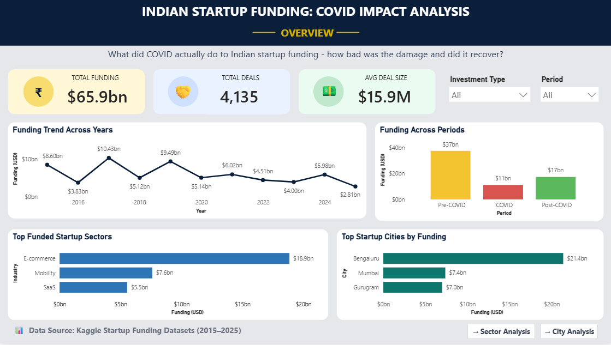
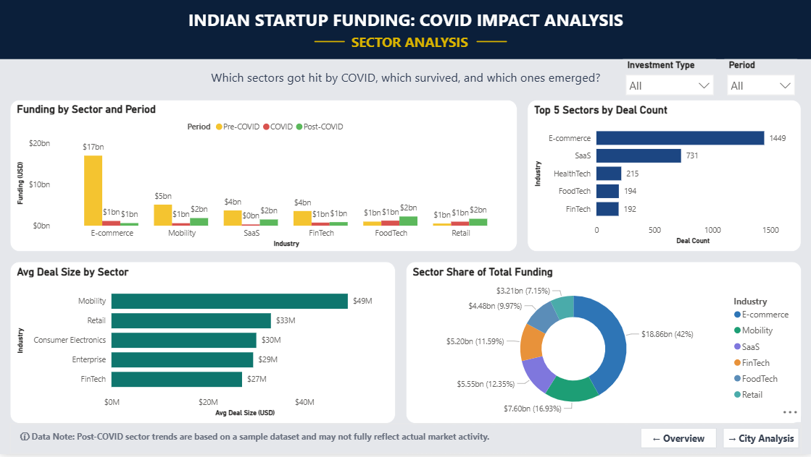
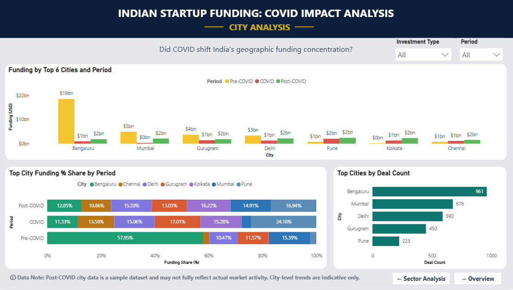

# Indian Startup Ecosystem: COVID Impact Analysis

A data analytics project exploring how the COVID-19 pandemic disrupted startup funding in India — and what the recovery looked like across sectors, cities, and investment types — based on funding data from 2015 to 2025.

---

## 🔍 Project Overview

When COVID-19 hit in 2020, India's startup ecosystem took a significant blow. Funding dried up, investor confidence dropped, and the recovery that followed was uneven — some sectors bounced back, others didn't.

This project tries to understand that disruption through data by looking at three distinct periods:

- **Pre-COVID (2015–2019)** — the baseline period before the pandemic
- **COVID (2020–2021)** — the period of disruption
- **Post-COVID (2022–2025)** — the recovery phase

The analysis covers the full pipeline — data cleaning in Python, structured querying in SQL, and a three-page interactive Power BI dashboard — with an honest look at what the data can and cannot tell us.

---

## 🖥️ Dashboard Preview

**Page 1 — Overview**



**Page 2 — Sector Analysis**



**Page 3 — City Analysis**



---

## 👥 Stakeholders

- **Startup Founders** — To understand which sectors and cities have historically attracted funding, and how macro shocks like a pandemic affect investor behavior
- **Venture Capitalists & Angel Investors** — To spot trends in deal volume, funding recovery, and sector-level resilience across periods
- **Policy Makers & Government Bodies** — To assess the measurable economic impact of COVID-19 on India's startup landscape and think about where support is needed

---

## 📦 Dataset

| Attribute | Details |
|---|---|
| **Source** | Kaggle — Indian Startup Funding Dataset |
| **Coverage** | 2015–2025 |
| **Raw Records** | 2015–2019: 3,036 rows · 2020–2025 sample: 1,100 rows |
| **Final Dataset** | 4,135 rows × 7 columns |
| **Period Buckets** | Pre-COVID (≤2019) · COVID (2020–2021) · Post-COVID (≥2022) |

---

## ⚠️ Data Limitations

This is real-world data — it's messy, incomplete, and has known issues. Rather than hiding that, here's exactly what to keep in mind when reading the findings:

| Limitation | Impact |
|---|---|
| **`amount_usd` has 31% nulls** | Funding totals are underestimates; treat comparisons as directional, not absolute |
| **2020–2025 is sample data, not complete** | Post-COVID figures likely underrepresent the actual ecosystem size |
| **`industry` standardization is ~85% coverage** | 170 rows couldn't be categorized even with keyword mapping |
| **E-commerce / Consumer Internet likely inflated** | It's a broad label that absorbs multiple sub-sectors |
| **`investment_type` is partially unreliable** | Inconsistent labeling in the source data — type-level findings need extra caution |
| **City mapping is approximate** | Manual standardization was applied; some assignments may not be perfectly accurate |

The findings in this project are best read as **directional signals**, not precise financial measurements.

---

## 🔄 Project Workflow

### Phase 1 — Data Cleaning (Python / Jupyter Notebook)

The raw data came from two separate sources and needed significant work before it was usable:

- Combined the 2015–2019 and 2020–2025 datasets into a single master dataset
- Dropped `sub_vertical` and `investors` — too sparse and inconsistent to add value
- Built a keyword-mapping function to standardize `industry` into 16 categories (~85% coverage)
- Manually mapped city name variants to consistent standardized names
- Collapsed inconsistent `investment_type` labels into cleaner categories
- Added a `period` column to tag each row as Pre-COVID, COVID, or Post-COVID
- Kept nulls in `industry` (170 rows), `city` (214 rows), and `amount_usd` (976 rows) — dropping them would have removed ~23% of the data and distorted the 2015 trends

**Output:** `cleaned_startup_funding_data.csv` — 4,135 rows × 7 columns

---

### Phase 2 — SQL Analysis (MySQL)

**Database:** `indian_startup_funding` · **Table:** `startup_funding`

- Ran validation checks first — row counts, null distribution, and distinct values to confirm the data loaded correctly
- Looked at year-on-year funding trends using aggregations and the LAG window function to calculate period-over-period % change
- Computed period-level totals and running totals to see how funding accumulated over time
- Broke down funding by sector — total funding, deal counts, and average deal size across all three periods
- Analyzed city-level concentration to see how much of the ecosystem is dominated by a handful of cities
- Examined investment type patterns — which types were most active and which had the largest average deals
- Ran cross-dimensional queries (sector × period, city × period) to find interaction patterns that single-dimension queries miss

---

### Phase 3 — Power BI Dashboard

**Data source:** `cleaned_startup_funding_data.csv`

**DAX Measures built:**
- `total_fundings` — Total funding in USD
- `total_deals` — Count of deals
- `avg_deal_size` — Average deal size

**Dashboard Pages:**

- **Page 1 — Overview:** The big picture — how much funding flowed in, how many deals were made, and how those numbers shifted across the three periods. Top sectors and cities are included for quick context
- **Page 2 — Sector Analysis:** A closer look at which industries were hit hardest by COVID, which ones recovered, and how deal sizes varied across sectors
- **Page 3 — City Analysis:** Explores how geographically concentrated India's startup funding really is — and whether that concentration changed before, during, and after COVID

---

## 📊 Key Findings

> All figures are based on available data. With 31% nulls in `amount_usd`, these totals are underestimates — the directional trends matter more than the exact numbers.

**Funding Trend**
- Funding dropped **70.19%** from Pre-COVID to the COVID period
- There was a partial recovery of **54.94%** from COVID to Post-COVID — but it never got back to Pre-COVID levels
- **2017 was the peak year**, with approximately $10.4B in recorded funding

**Sector Insights**
- **E-commerce** dominated Pre-COVID funding at ~$17B — though this is likely overstated due to how broadly the label is applied
- **Cleantech** and **AI & DeepTech** show no recorded activity during COVID and Post-COVID in this dataset
- **Mobility** had the highest average deal size of any sector at ~$56.3M

**City Insights**
- **Bengaluru** alone accounted for 32.4% of total recorded funding
- The **top 5 cities** — Bengaluru, Mumbai, Delhi, Gurugram, and Noida — together captured 72.27% of all funding, showing just how concentrated the ecosystem is

**Investment Type Insights**
- **Seed** rounds were the most active investment type during COVID by deal count
- **Growth** rounds carried the largest average deal size at ~$234M

---

## 📁 Project Structure
```
Indian-Startup-Ecosystem-COVID-Impact-Analysis/
│
├── data/
│   ├── raw/
│   │   ├── startup_funding.csv
│   │   └── startup_funding_2020_2025.csv
│   └── processed/
│       └── cleaned_startup_funding_data.csv
│
├── notebooks/
│   └── data_cleaning.ipynb
│
├── sql/
│   └── analysis_queries.sql
│
├── powerbi/
│   └── indian_startup_funding.pbix
│
├── screenshots/
│   ├── page1_overview.png
│   ├── page2_sector_analysis.png
│   └── page3_city_analysis.png
│
└── README.md
```
---

## 🛠️ Tools & Technologies

| Layer | Tool |
|---|---|
| Data Cleaning | Python · pandas · NumPy · Jupyter Notebook |
| Data Storage | CSV · MySQL |
| SQL Analysis | MySQL Workbench |
| Visualization | Microsoft Power BI Desktop |
| Version Control | Git · GitHub |

---

## 🚀 How to Use

**To explore the SQL analysis:**
1. Import `data/processed/cleaned_startup_funding_data.csv` into MySQL
2. Create a database named `indian_startup_funding` and a table named `startup_funding`
3. Open `sql/analysis_queries.sql` — each query has a comment explaining what it's answering

**To explore the Power BI dashboard:**
1. Open `powerbi/indian_startup_funding.pbix` in Power BI Desktop
2. If prompted for a data source, point it to `data/processed/cleaned_startup_funding_data.csv`
3. Use the Period and Investment Type slicers to filter across pages
4. Navigate between pages using the buttons at the bottom of each page

**To review the cleaning process:**
1. Open `notebooks/data_cleaning.ipynb` in Jupyter Notebook or VS Code
2. Run cells sequentially — the notebook walks through each cleaning step in order

---

## 👤 Author

**Deepak M** 